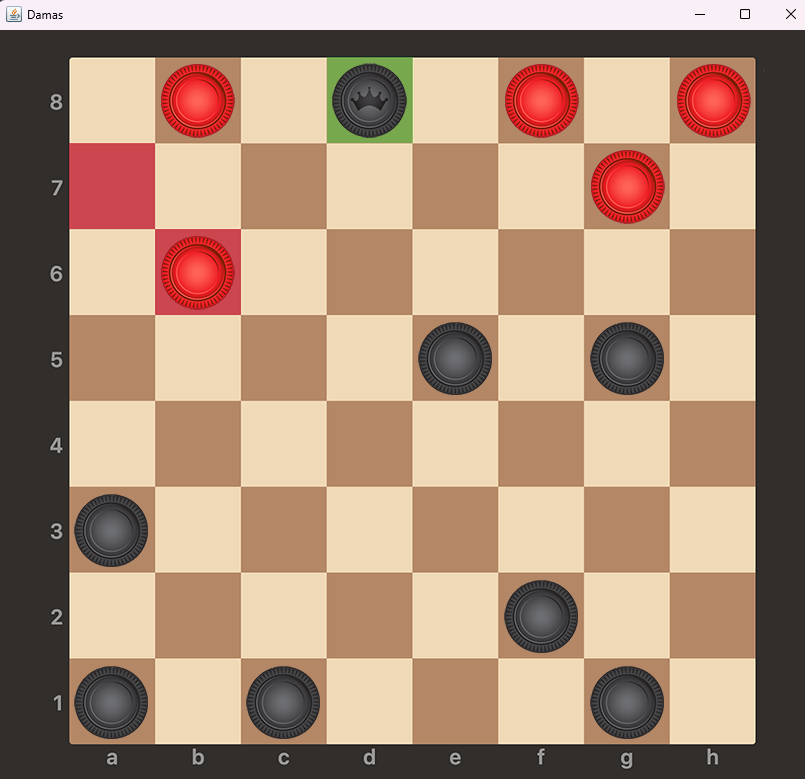
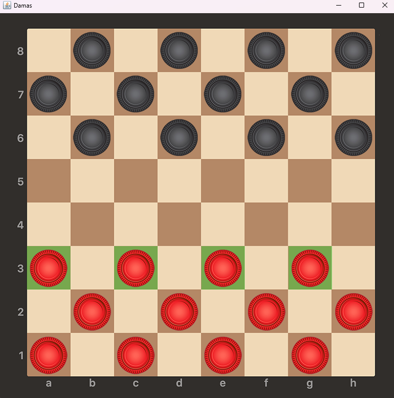
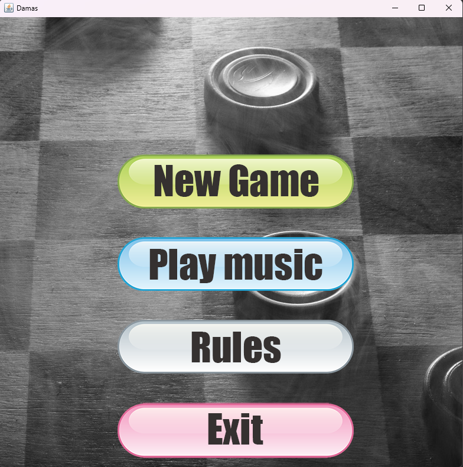
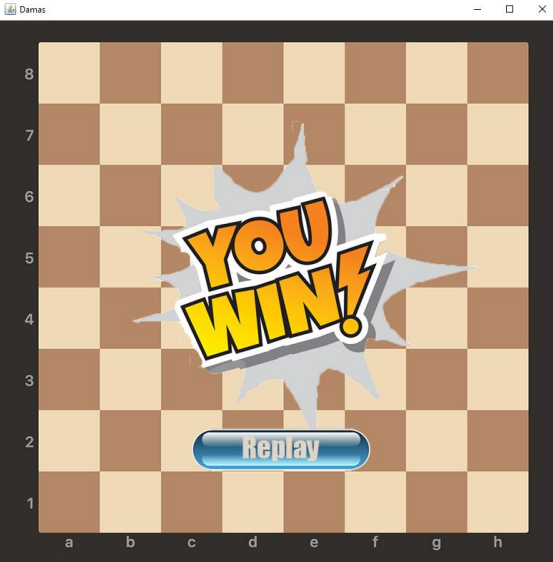

# Checkers game

This project implements the game of checkers following the best practices of Object-Oriented. 
To achieve this, the architecture of the classes was created before implementing the code.

Artificial Intelligence was also created to play against the player. It has two levels of intelligence:
1. the **basic** one always chooses randomly
2. the **medium** always tries to capture the most pieces in a single move.

The interface is also responsive according to the size of the window. 

Examples of images of the game:

<table>
  <tr>
    <td></td>
    <td></td>
</tr>
  <tr>
    <td style="text-align: center;"><em>1. Example of a game</em></td>
    <td style="text-align: center;"><em>2. Example of a starting game</em></td>
  </tr>
</table>

<table>
  <tr>
    <td></td>
    <td></td>
</tr>
  <tr>
    <td style="text-align: center;"><em>3. Menu of the game</em></td>
    <td style="text-align: center;"><em>4. Example of winning the game</em></td>
  </tr>
</table>